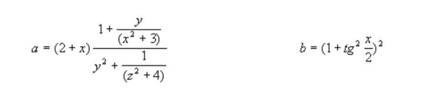

# Лабораторная работа №2  
**Тема:** Разработка визуальных пользовательских интерфейсов для программирования ввода-вывода и основных операторов языка C# на платформе .NET Framework

---

## 1. Цель работы  

Целью лабораторной работы является изучение основ разработки визуальных пользовательских интерфейсов для программирования ввода-вывода и основных операторов языка C# на платформе .NET Framework.

---

## 2. Задание на лабораторную работу  

### Задание 1

| № | Задания |
|:-:|:--------|
| 1 | Даны x, y, z. Вычислить a, b, если: |
| 2 | Вычислить площадь треугольника по всем известным формулам. Длины сторон заданы тремя числами a, b и c. |
| 3 | Вывести сообщение о количестве корней квадратного уравнения и найти эти корни. |
| 4 | Написать программу преобразования цифр в слова. |

**Формулы для задания №1:**  
Формулы для задания №1.1 представлены на рисунке 1.  

  
   
  <em>Рисунок 1 – Формулы для задания №1</em>

---

### Задание 2  

1. Создать структуру согласно предметной области варианта.
2. Добавить метод отображения данных структуры.

| Вариант | Объект |
|:--------:|:------:|
| 11 | Завод |

---

